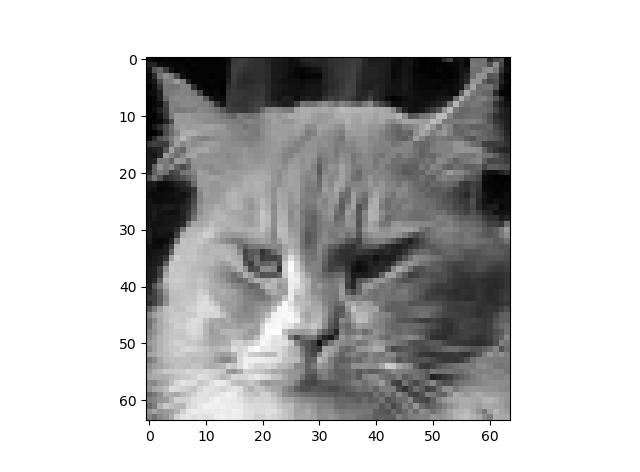

# Python-Data-Visualization
Data visualization using Python

<center></center>

## Installation
[MulticoreTSNE](https://github.com/DmitryUlyanov/Multicore-TSNE) installation using pip:
```
pip install MulticoreTSNE
```

## Example output

### View on initial data

<center></center>
<center></center>

### After applying edge detection:

<center></center>
<center></center>

The link on the dataset:
https://github.com/bioramble/pca
